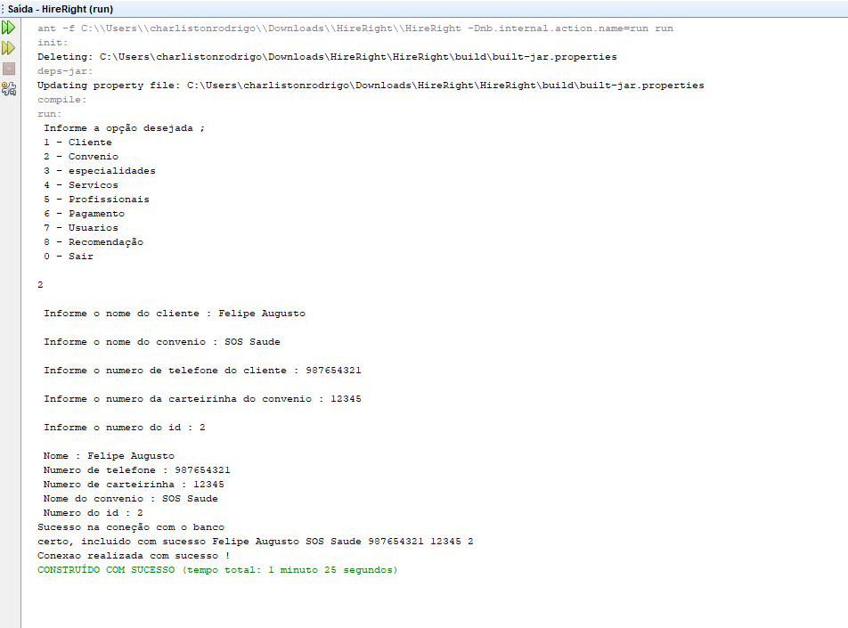
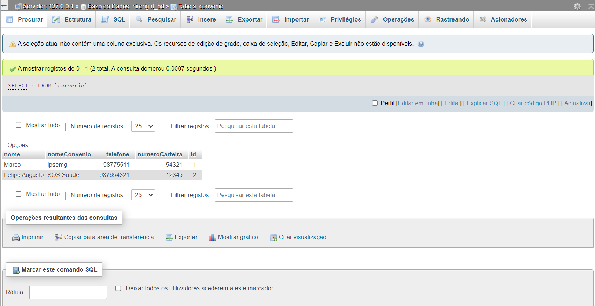

# Projeto_Hirerigth

## Sobre

Este e um projeto desenvolvido para o atendimento de clientes de uma clínica chamada HIRERIGTH. Onde é salvo todos os dados de convenio de um cliente conveniado em
um banco de dados relacional MySQL.

## Informações

As demais implementações que constam no menu inicial do aplicativo serão implementadas posteriormente no código fonte deste projeto.

## Layout

  
  

